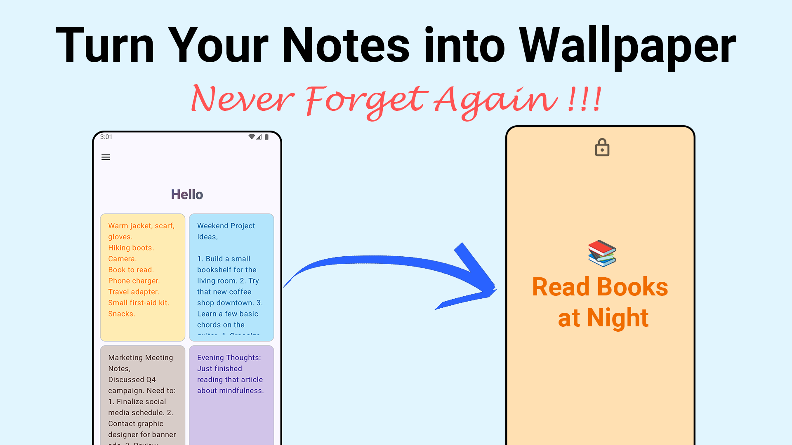

# Notes on Screeen

## ✨ **Never Forget Again! Turn Your Notes into Wallpaper!** ✨

In today's fast-paced world, it’s easy to lose track of important tasks and goals. 

Notes on Screen solves this by turning your simple notes into beautiful wallpapers for your Android device. 

Stop relying on memory – *see* your priorities every time you look at your phone! Perfect for students, busy professionals, or anyone who wants to stay organized and focused.

This app isn’t just about taking notes; it’s about **visual reinforcement** – a powerful way to boost productivity and achieve your objectives.

**Stop relying on memory. Start *seeing* your success.**

## **Here's how Notes on Screen helps:**

*   **Effortless Note-Taking:** Quickly write tasks, reminders, affirmations, or anything you need to remember.
*   **Wallpaper Reinforcement:** Instantly turn notes into vibrant wallpapers that keep crucial information top of mind.  Say goodbye to forgotten commitments!
*   **Personalized Focus:** Customize colors to create a visually appealing and motivating reminder system tailored to *your* needs.
*   **Unlock Peak Productivity:** Say goodbye to procrastination and hello to laser focus.  Stay motivated and on track towards achieving your dreams.

## **Features You’ll Love:**

*   📝 Simple & Powerful Note Creation
*   🖼️ One-Tap Wallpaper Conversion (Home & Lock Screen)
*   🎨 Customizable Colors for a Personalized Experience
